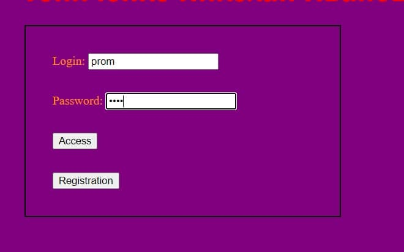
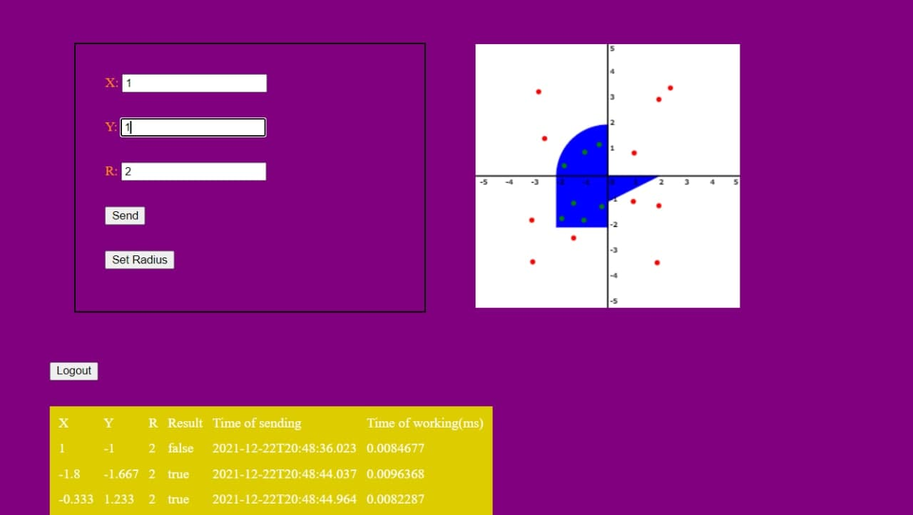

# Simple web application
___
Here is the Frontend part of my web application
[Link to the Backend](https://github.com/Nikolay-Gonichenko/Web4Back)
Fronted is implemented with Angular

The application contains two pages. The first page is authorization page. For authorization I used __Spring Security with JWT Token__. 

On the second page user can shoot in aread. There are two ways to shoot. User may select the coordinates and radious of the pictere and send it. Or user can choose radious and click on the area for shooting. Also, there is a table with all shoots for particular user.

For saving all data (user's name, password, points) I used __Spring Data and PostgreSQL.__

The Backend part is created with __Spring Boot__.
